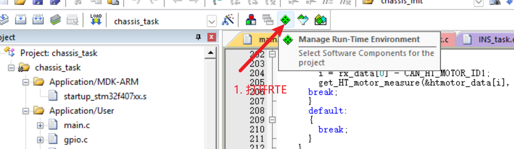
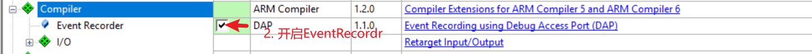
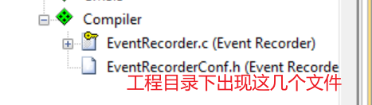
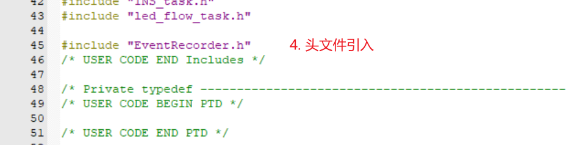
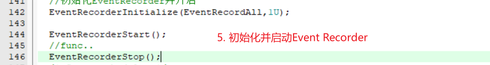
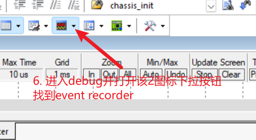
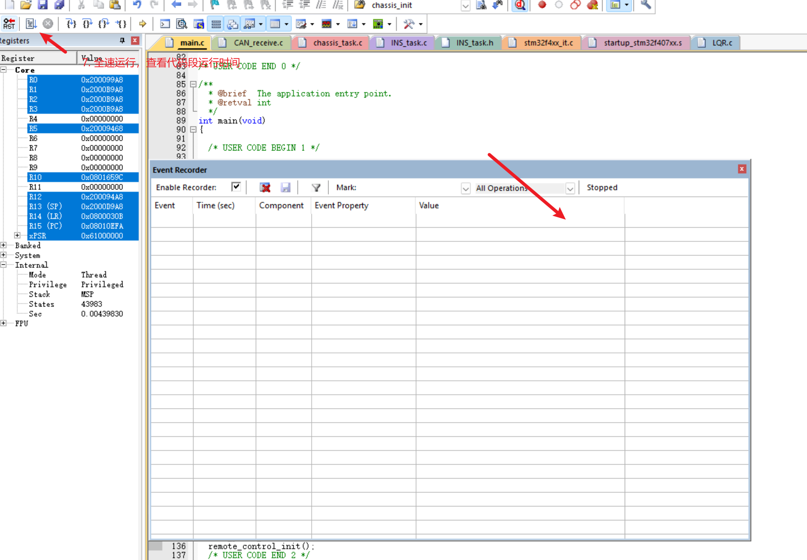

### 检测某段代码运行时间

#### 1.直接采用HAL_GetTick();

```c
int32_t t0,t1,time;
t0=HAL_GetTick();
//your func...
t1=HAL_GetTick();
time=t1-t0;
```

#### 2. Event Recorder获取高精度时间（没什么特殊需求其实可以不用）

##### 1. 参考CSDN链接

[参考CSDN链接](https://blog.csdn.net/Simon223/article/details/89476922?ops_request_misc=&request_id=&biz_id=102&utm_term=event%20recoder%E4%BD%BF%E7%94%A8%E6%96%B9%E6%B3%95&utm_medium=distribute.pc_search_result.none-task-blog-2~all~sobaiduweb~default-1-89476922.142^v102^pc_search_result_base5&spm=1018.2226.3001.4187)

##### 2. 配置流程（个人经验）



---





---



---

-----

---


