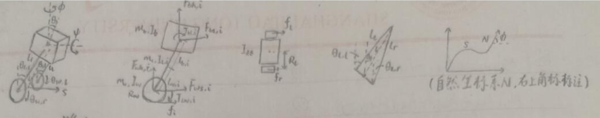
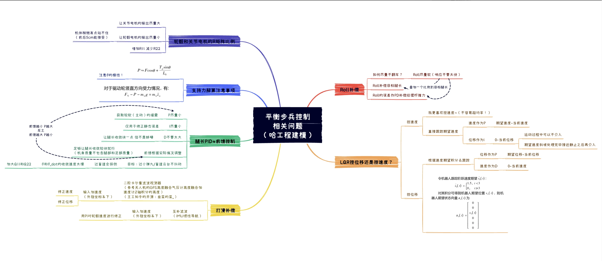

# WHU_balance_infantry

## 1.介绍

基于交✌平步理论分析，港大代码的平衡步兵测试代码

##### 1.1软件架构

程序编写采用vscode结合keil进行高效编写，采用MATLAB拟合LQR VMC拟合矩阵

##### 1.2使用说明

1. **05LQR拟合文件夹**：传入自己平步的各种物理参量，设置好Q R 矩阵个各变量权重，拟合数据使用代码示例：

    ```c
    float Fit_Matrix[40][6];
    float L_length ,R_length;
    uint8_t i,j,index;
    
    for (i=0;i<4;i++)
    {
        for (j=;j<10;j++)
        {
            index=i*10+j;
            LQR[i][j] = Fit_Matrix[index][0] + Fit_Matrix[index][1]*L_length + Fit_Matrix[index][2]*R_length + Fit_Matrix[index][3]*L_length*L_length + Fit_Matrix[index][4]*L_length*R_length + Fit_Matrix[index][5]*R_length*R_length
        }
    }
    ```

    

2. **04jacbon_calculation文件夹**：运行matlab工程中的主文件，会生成相应的拟合矩阵在左侧工作栏，同时可以在主文件最下方输入腿长腿角进行测试，反馈雅克比矩阵和髋关节扭矩大小

3. **01Balance_chassis_task文件夹**：用Keil打开chassis_task.uvprojx文件，编译，下载，调试

##### 1.3调试建议 

> 借鉴CADN上 星夜雨夜的调试建议...


## 2.==平衡步兵调试规范==

##### 2.1调试前置知识

1. 一定要熟读上海交通大学2023年开源代码，建议B站搜索灯哥开源或者其他战队平步代码熟悉底盘控制逻辑
2. 每次拟合出来能用的虚拟矩阵一定要标注好日期，对应将QR矩阵权重存入excel表格中（目前还没有做）

#### 2.2实际调节注意事项

1. 新手一定要有==两个及以上的队员==陪同下调平步**（小心轮腿伤人！！！）**
2. 建议**控制变量法**将某个状态参量调好之后在调其他参量

## 3.原理讲解

### 3.0 底盘控制逻辑架构图

### 3.1 LQR原理讲解

[上交开源平衡步兵原理推导](file:///E:/02GC/02RM_Balance_git/08%E5%BC%80%E6%BA%90%E8%B5%84%E6%96%99(%E5%8E%9F%E7%90%86%E4%BA%86%E8%A7%A3%E7%9C%8B%E4%B8%8A%E4%BA%A4%E5%BC%80%E6%BA%90)/02%E4%B8%8A%E6%B5%B7%E4%BA%A4%E9%80%9A%E5%A4%A7%E5%AD%A6RoboMaster2023%E5%B9%B3%E8%A1%A1%E6%AD%A5%E5%85%B5%E6%8E%A7%E5%88%B6%E7%B3%BB%E7%BB%9F%E5%BC%80%E6%BA%90/WBR_control.html)

### 3.2 车体各部分正方向标定（极其重要）

#### 3.2.1 理论建模时个状态量的正方向



#### 3.2.2实际力矩极性说明


### 3.2 关节电机角度解算足端坐标（得到腿长和摆动角度）

### 3.3 MATLAB拟合出K矩阵讲解

### 3.4 VMC雅可比矩阵计算

[韭菜的菜_的VMC解算过程](https://zhuanlan.zhihu.com/p/613007726)

[对应b站视频](https://www.bilibili.com/video/BV1Hk4y1h7r8?spm_id_from=333.788.player.player_end_recommend_autoplay&vd_source=171f4dac7a337a3b5b633859359888d2&trackid=web_related_0.router-related-2206146-8k2m6.1763265340311.805)

### 3.5 虚拟腿关节力矩原理及MATLAB解算

### 3.6 MATLAB仿真环节（后人自己开发吧）

### 3.7平衡步兵常见问题




## 4.研发计划（基于上交的研发路线）

### 进阶功能

提升鲁棒性，实现一些进阶功能如跳跃、扰动自适应等。

- [x] 原地静止（1. 尝试增大速度环系数+速度环输入限幅缩小+减小角度系   位置控制够了，不用力控）
- [x] 测试不同腿长起身效果，大角度状态缩短腿长
- [ ] 增加不同地形的通过能力
- [x] 扰动观测器
- [x] 打滑检测（观测器+力位混控）
- [x] 离地检测+落地（通过腿长PID输出可估计地面支持力，roll PID系数表示为腿长PID的函数）
- [ ] 陀螺平移（偏心旋转，周期速度规划）
- [ ] 主动跳跃（运动中跳跃/原地）
- [ ] 自动跳跃运动规划
- [ ] 功率限制
- [ ] 测试

###  整车

比赛用车整备至上场状态

硬件

- [ ] 走线整理
- [ ] 滑环焊线
- [ ] 云台
- [ ] 轮电机id+换线
- [ ] minipc
- [ ] 相机
- [ ] 裁判系统
- [ ] 电容
- [ ] 继电器
- [ ] 保护
- [ ] 保养+备件

软件

- [ ] 上板程序
- [ ] 云台程序
- [ ] 遥控器操作
- [ ] 键鼠操作
- [ ] 自瞄
- [ ] 功率限制
- [ ] ui

## 5.前存在的问题

- [ ] 升降腿慢
- [x] 感觉两条腿有点劈叉   :relaxed:LQR计算的问题
- [ ] 腿过障碍物的时候会抖动

---

先看波形

调节roll轴pid

---

初步怀疑是2 4 电机解算出现问题

> 找到问题发现其实并不是关节力矩映射有问题，而是LQR解算出来的参数有问题，现在怀疑是拟合的不好

- [ ] 重力补偿前馈力给大一点
- [ ] 写一下解算过程步骤
- [ ] 写键盘呢控制逻辑


#### 参考文献

[轮腿机器人代码调试补充](https://blog.csdn.net/Kevin3389179304/article/details/148379498?ops_request_misc=%257B%2522request%255Fid%2522%253A%2522c9e3eb48c656ad1cc51178d32528747e%2522%252C%2522scm%2522%253A%252220140713.130102334.pc%255Fall.%2522%257D&request_id=c9e3eb48c656ad1cc51178d32528747e&biz_id=0&utm_medium=distribute.pc_search_result.none-task-blog-2~all~first_rank_ecpm_v1~rank_v31_ecpm-2-148379498-null-null.142^v102^pc_search_result_base5&utm_term=%E5%B9%B3%E8%A1%A1%E6%AD%A5%E5%85%B5%E8%B0%83%E8%AF%95%E6%80%9D%E8%B7%AF&spm=1018.2226.3001.4187)


